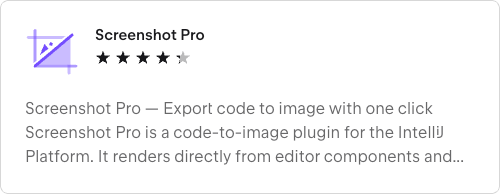

<h2>Screenshot Pro — Export code to image with one click</h2>

<b>Screenshot Pro</b> is a code-to-image plugin for the IntelliJ Platform. It renders directly from editor components and supports exporting both the <i>Gutter</i> and the <i>Content Component</i>, or only the selected code when applicable.

<h3>Key Features</h3>
<ul>
  <li><b>Smart scope</b>: If text is selected, export only the selection; otherwise export the whole file area.</li>
  <li><b>Gutter toggle</b>: Choose whether to include gutter elements such as line numbers and folding markers.</li>
  <li><b>Export modes</b>: <b>Clipboard</b> (copy to clipboard), <b>Save</b> (write to disk), or <b>All</b> (both).</li>
</ul>

<h3>How to Use</h3>
<ol>
  <li>(Optional) Select the code you want to export in the editor.</li>
  <li>Use the context menu: <b>Screenshot Selected Code</b> / <b>Screenshot All Code</b>, or the shortcut (e.g., <code>Shift + Ctrl + S</code>).</li>
  <li>Depending on your settings, the image will be copied to the clipboard, saved to a directory, or both.</li>
</ol>

<h3>Settings</h3>

Path: <b>Settings | Other Settings | Screenshot Pro</b>

<ul>
  <li><b>Include gutter</b>: Whether to include the gutter.</li>
  <li><b>Export mode</b>: Clipboard / Save.</li>
  <li><b>Output directory</b>: Folder to save images (defaults to <code>~/Downloads</code> if not set).</li>
</ul>

<h3>Privacy & Security</h3>
<ul>
  <li>The plugin does not access the network or upload your code.</li>
</ul>

## 🙏 Acknowledgments / References

This project draws inspiration from the following open-source projects. Many thanks to their authors and contributors:

- [amaembo/screenshoter](https://github.com/amaembo/screenshoter)
- [0x3C50/easy-code-screenshots](https://github.com/0x3C50/easy-code-screenshots)

